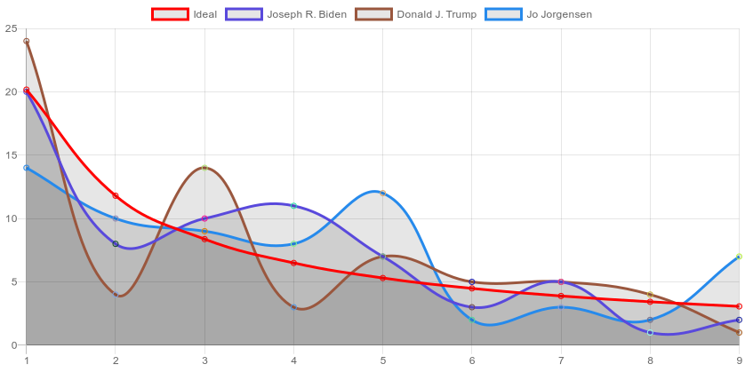
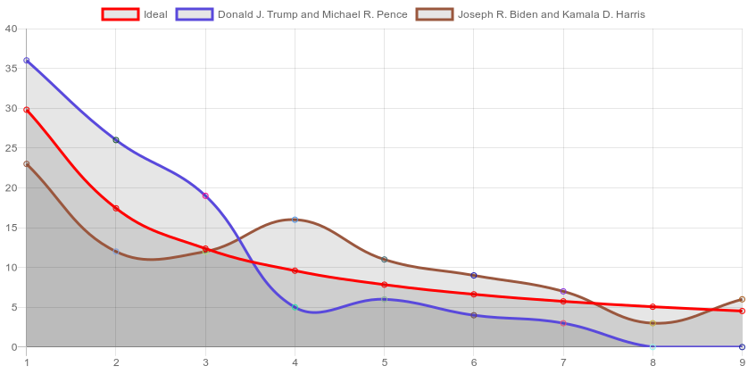
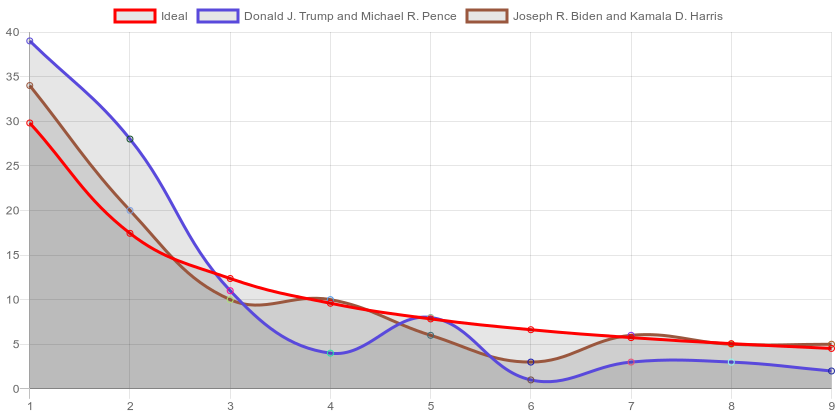
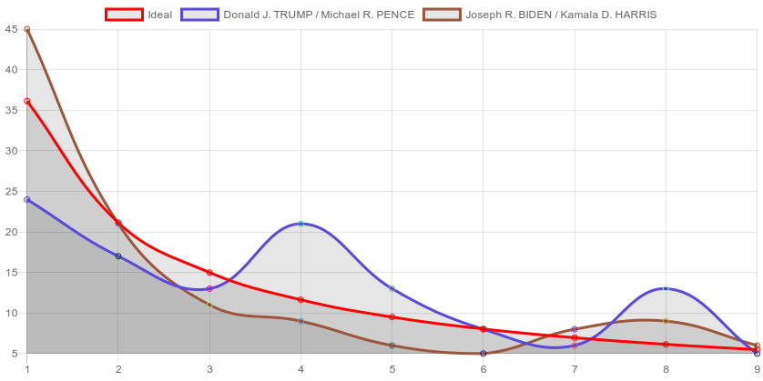

# benford-law-2020-us-election
Verifying compliance of 2020 US election data against Benford's Law.

# If you wish to generate it on your own
```sh
git clone https://github.com/paras20xx/benford-law-2020-us-election.git
cd benford-law-2020-us-election

# Install Node JS from https://nodejs.org/en/download/
#     OR
# Run "nvm install" # https://github.com/nvm-sh/nvm#installing-and-updating

npm install
npm run copy-files-from-to
npm run process-dumped-data
npm start # This would generate graphs from the processed data

# Open the .png files which got generated (These files can also be previewed from README.md)
```

# Generated graphs

## Milwaukee, Wisconsin (Sample size: 478)


<details>
  <summary>Milwaukee - Base 3</summary>
  <p></p>
</details>
<details>
  <summary>Milwaukee - Base 4</summary>
  <p></p>
</details>
<details>
  <summary>Milwaukee - Base 5</summary>
  <p></p>
</details>
<details>
  <summary>Milwaukee - Base 6</summary>
  <p></p>
</details>
<details>
  <summary>Milwaukee - Base 7</summary>
  <p></p>
</details>
<details>
  <summary>Milwaukee - Base 8</summary>
  <p></p>
</details>
<details>
  <summary>Milwaukee - Base 9</summary>
  <p></p>
</details>

## Chicago, Illinois (Sample size: 2069)


<details>
  <summary>Chicago - Base 3</summary>
  <p></p>
</details>
<details>
  <summary>Chicago - Base 4</summary>
  <p></p>
</details>
<details>
  <summary>Chicago - Base 5</summary>
  <p></p>
</details>
<details>
  <summary>Chicago - Base 6</summary>
  <p></p>
</details>
<details>
  <summary>Chicago - Base 7</summary>
  <p></p>
</details>
<details>
  <summary>Chicago - Base 8</summary>
  <p></p>
</details>
<details>
  <summary>Chicago - Base 9</summary>
  <p></p>
</details>


## Nebraska (Sample size: 93)


## Michigan (Sample size: 83)


## Colorado (Sample size: 64)


## Georgia (Sample size: 159)

### Georgia - Election day votes


<details>
  <summary>Georgia - Absentee by mail votes</summary>
  <p></p>
</details>

<details>
  <summary>Georgia - Advanced voting votes</summary>
  <p></p>
</details>

<details>
  <summary>Georgia - Provisional votes</summary>
  <p></p>
</details>


## Alabama (Sample size: 67)



## Iowa (Sample size: 99)

### Iowa - Election day votes


<details>
  <summary>Iowa - Absentee votes</summary>
  <p></p>
</details>


## Kentucky - Election day votes (Sample size: 120)



## Tennessee (Sample size: 95)


## Washington (Sample size: 4834)

